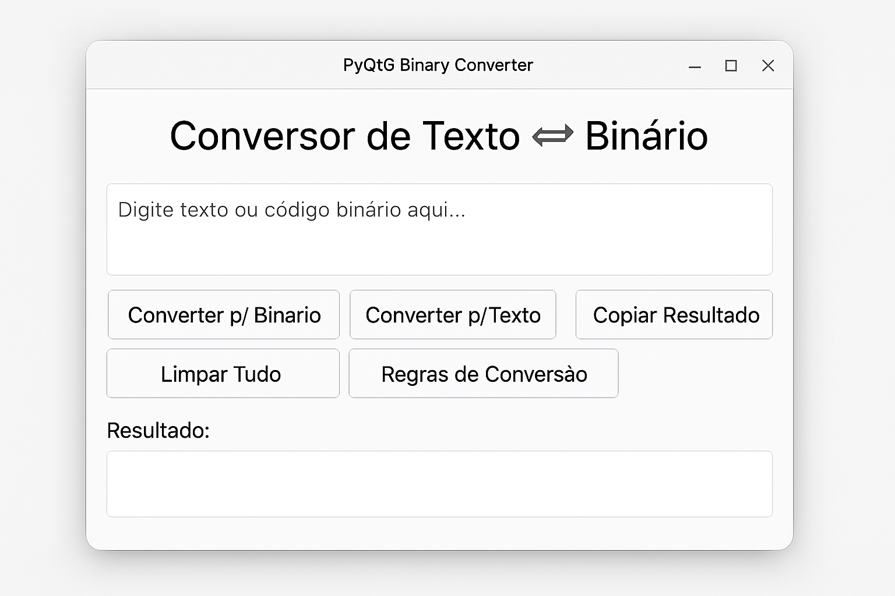

📘 PyQt6 Binary Converter

Um aplicativo desenvolvido em Python + PyQt6 para converter Texto ⇄ Binário de forma simples, rápida e com interface moderna.

✨ Funcionalidades

✔ Converter Texto → Binário
✔ Converter Binário → Texto
✔ Validação de binário (somente grupos de 8 bits)
✔ Botão para copiar o resultado
✔ Janela com regras de conversão
✔ Interface moderna em PyQt6
✔ Tratamento de erros com mensagens amigáveis

🖥️ Interface




A interface é construída com PyQt6, com design limpo, profissional e responsivo.

## 📦 Instalação

### 1️⃣ Clone o repositório

```bash
git clone https://github.com/DouglasReis07/Pyqt6-binary-converter.git
cd Pyqt6-binary-converter

🚀 Como executar
1. Instale o PyQt6:
pip install PyQt6

2. Execute o programa:
python main.py

📄 Regras de Conversão
🔹 Texto → Binário

Cada caractere é convertido para seu código ASCII

O número ASCII é transformado para binário de 8 bits

Os bytes são separados por espaços

🔹 Binário → Texto

O código binário deve estar em grupos de 8 bits

Cada grupo de 8 bits é convertido em um valor decimal

O decimal é mapeado para seu caractere ASCII

🧩 Estrutura do Projeto
📁 Pyqt6-binary-converter
 ├── main.py
 ├── README.md
 ├── requirements.txt (opcional)
 └── /assets (opcional)

📦 Requisitos

Python 3.8+

PyQt6

🛠️ Tecnologias utilizadas

Python

PyQt6

Git / GitHub

🤝 Contribuições

Pull requests são bem-vindos!
Para mudanças grandes, abra uma issue primeiro para discutirmos sua ideia.

📜 Licença

Este projeto está sob a licença MIT — use livremente.

🚀 Autor

Feito por Douglas Reis
GitHub: https://github.com/DouglasReis07
